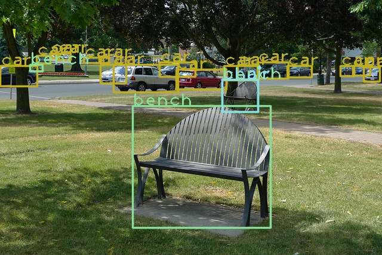

# TensorRT Deformable Detr (Python)

TensorRT for Deformable Detr(use python)
## Test enviroments
    TensorRT 8.4.1.5
    Ubuntu 18.04
    mmdetection 2.24.1
    polygraphy(TensorRT Tool)

## A quick demo

### 1. Convert deformable detr model form pytorch to onnx

    python3 onnx_deformable_detr.py --config ${mmdet_path}/configs/deformable_detr/deformable-detr_twostage_refine_r50_16x2_50e_coco.py --checkpoint ${mmdet_path}/work_dirs/deformable_detr_twostage_refine_r50_16x2_50e_coco_20210419_220613-9d28ab72.pth --output deformable_detr.onnx --h 750 --w 1333

### 2.Genrate TensorRT engine

    polygraphy convert deformable_detr.onnx --workspace 8G -o deformable_detr_fp32.engine

### 3.Inference

    python3 demo.py --engine deformable_detr_fp32.engine --thresh 0.3 --img ${your_picture_path} --output result.jpg

## Inference performance(only inference time in GPU)

GPU|Model|Mode|Inference time
:--: | :--: | :--: | :--: |
3090 | deformable_detr_twostage_refine_r50_16x2_50e_coco | fp32 | 35ms
3090 | deformable_detr_twostage_refine_r50_16x2_50e_coco | fp16 | 17ms

</img>
